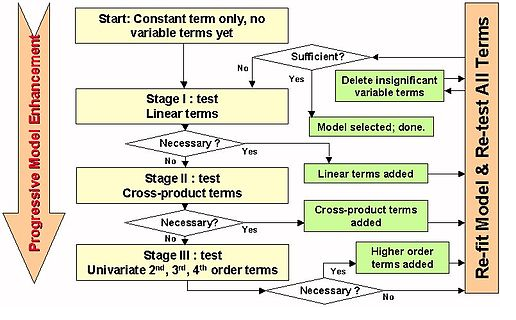

```{r setup, include=FALSE}
knitr::opts_chunk$set(echo = TRUE)
# load libraries

library(knitr)
library('xlsx')
library(dplyr)

#caret library is needed for varImp function
library(caret)

#for visualization
library(ggplot2)
library(ggrepel)
library(randomcoloR)


library(scales)

library(psych) 
library(kableExtra)
library(plyr)

# read code chunks
read_chunk('R/load_dataset.R')
read_chunk('R/tidy_dataset.R')
read_chunk('R/feature_sel_stepwise.R')
read_chunk('R/attrition_viz.R')
read_chunk('R/desc_stat.R')
read_chunk('R/age_inc_analysis.R')
```
### Load Data
```{r load_dataset}
```

### Tidy Data
```{r tidy_dataset}
```

### Descriptive Statistics
```{r desc_stat}
```

### Find a suitable model for Attrition based on given data

To determine the initial model,  glm is used. It allows us to give option of defining response variable as binomial, for the given dataset, Attrition is the response variable and has 2 values , TRUE/FALSE. For glm, R converts categorical variables into indicator variables. It does not like spaces in categorical values, so the given dataset is modified first to remove spaces from the categorical variables.

**initial model**
```{r feat_sel_init}
```


AIC statistics for this model is 901.66.

**reduced model**
```{r feat_sel_step}
```

We used stepwise selection method to select the appropriate predictors for Attrition model.default dirction= "both".  AIC statistics for this model is 901.66. Stepwise selection , chose the 10th model @ AIC = 884.0241
This is not the best model but considering our prelimenary analysis, this model should be able to provide us with important predictors. 

*About the stepwise selection method*
step uses add1 and drop1 repeatedly; it will work for any method for which they work, and that is determined by having a valid method for extractAIC. When the additive constant can be chosen so that AIC is equal to Mallows' Cp, this is done and the tables are labelled appropriately.

stepwise selection method: 

*Image courtesy: Kelas Karyawan - kurikulum.org*

**Important variables**


varImp() - A generic method for calculating variable importance for objects produced by train and method specific methods

```{r feat_sel_varimp}
```


```{r feat_sel_plot}
```

Above plot has top 10 important factors from our selected Model. We will discuss the top 3 -

1- OVerTime 
2- StockOptions
3- Environment Satisfaction

### Visualize attrition and some of its factors

```{r plot_attr}
```


In the past year we have seen 16% Attrition in this company. Let's analyze some of these factors and see if there is any relation with Attrition.

**OverTime and  Attrition **

Overtime can be positive in that it allows employees the opportunity to make extra money and to make their mark on their workplaces, but it can also be negative in that too much overtime can lead to employee burnout.When employees are overworked, they become less productive and are more inclined to quit their job for other opportunities.


```{r plot_attr_ot}
```

There are 200+ people leaving the company , out of which about 54% did Overtime. The plot showing retention, about 24% employees did overtime.   POints to consider -

-  What is the need for OverTime? Is this requirement concentrated to cetain departments ?
-  Are you compensating your employees enough for the overtime ?


**Stock Options and Attrition **
Traditionally, stock option plans have been used as a way for companies to reward top management and "key" employees and link their interests with those of the company and other shareholders.Stock Option plans may be intended to give all employees stock in the company or to just provide a benefit for some "key" employees

```{r plot_attr_inv}
```

About 65% employees leaving the company have stocl lvl option 0. Majority of retained employees have StockOption lvl 1. Companies can have different plans for stock options and keep top benefits for the key employees but you may want to revise your lvl 0 stock option to get more employees thinking about long term benefits.


**Environment Satisfaction and Attrition **

Many businesses fail to understand the importance of working environment for employee . Employee us an essential component in the process of achieving the mission and vision of business. To meet the standards of organization, employees need a working environment that allows them to work freely without problems that may restrain them from performing upto the level of their full potential.Work environment consists of employees safety, job security, relations with co-workers, work recognition , motivation for performing well  among many others.

```{r plot_attr_env}
```

About 30% of the employees leaving the company  show low environment satisfaction.Close to 50% people leaving the company had high environment satisfaction but there could be other factors leading them to seek other oportunities  . 

Skip level meetings are a suggested way to get feedback about immediate supervisors . Periodic performance appreciations and team building activities are a good way to boost a positive work environment.


### Data Visualization

```{r age_inc_analysis}
```


